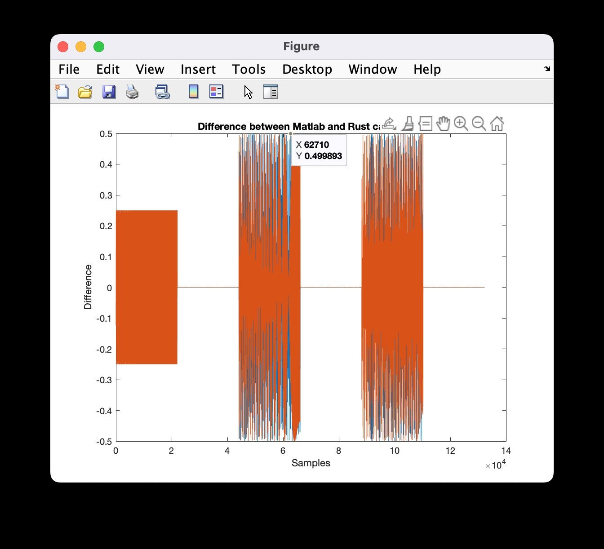
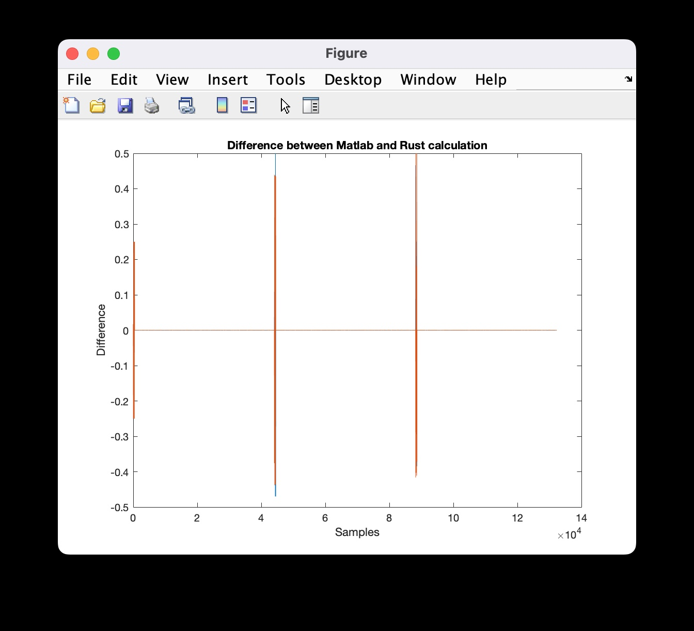
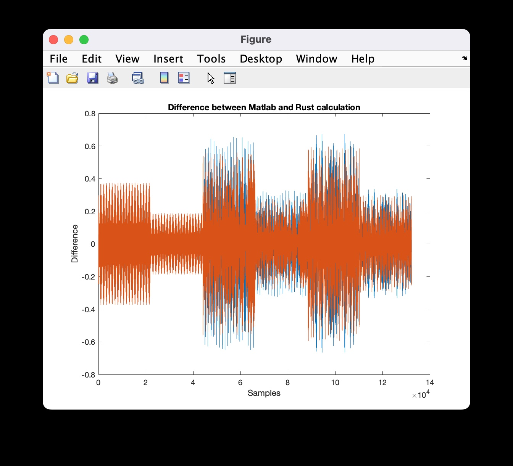
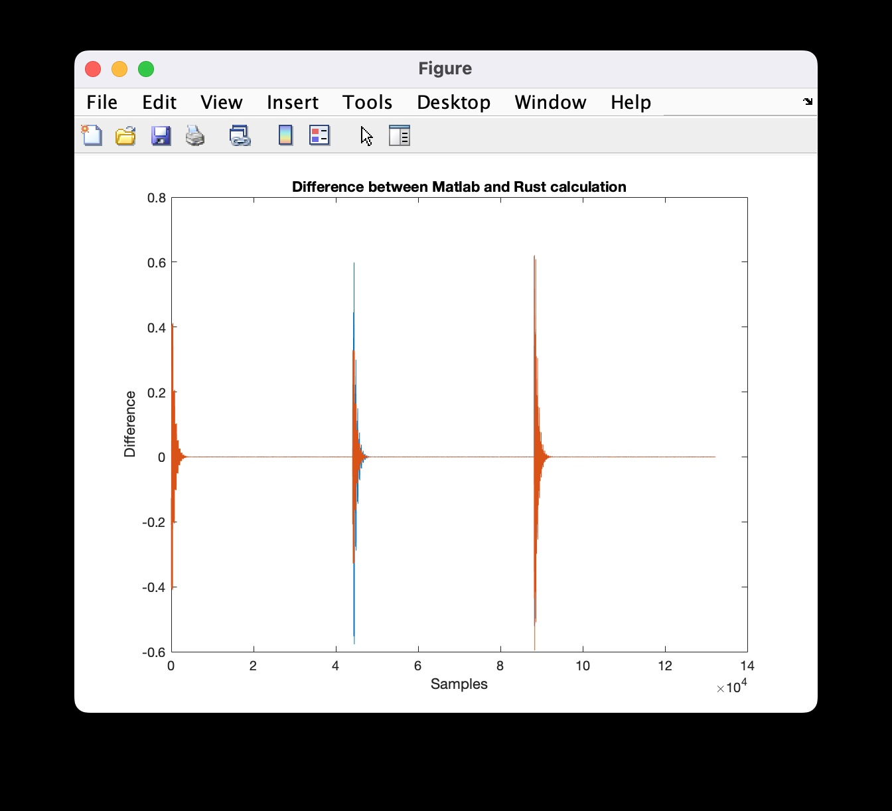

# Difference Plot 

## FIR
### Difference for `sweep.wav` at delay time 0.5 and gain 0.5

### Difference for `sweep.wav` at delay time 0.01 and gain 0.5

## IIR
### Difference for `sweep.wav` at delay time 0.5 and gain 0.5

### Difference for `sweep.wav` at delay time 0.01 and gain 0.5
